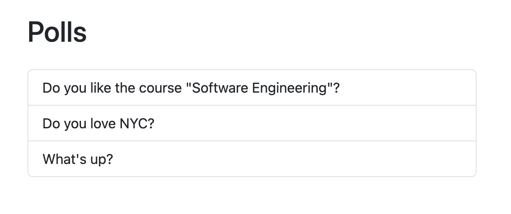

# SWE1 - APP

This is the personal assignment for **NYU Fall 2025 – CS-GY 6063-1-INET**:  
**Django “Hello World” Developed and Deployed**




This repository contains a classic **Polls** application with a clean UI (Bootstrap), end-to-end CRUD, and deployment scripts for **AWS Elastic Beanstalk**.

---

## Project Structure
```
.
├── polls/
│   ├── admin.py
│   ├── models.py
│   ├── urls.py
│   ├── views.py
│   └── templates/polls/
│       ├── index.html
│       ├── detail.html
│       └── results.html
├── mysite/
│   ├── settings.py
│   ├── urls.py
│   └── wsgi.py
├── static/
├── requirements.txt
├── Procfile                # for EB / Gunicorn
└── README.md
```
